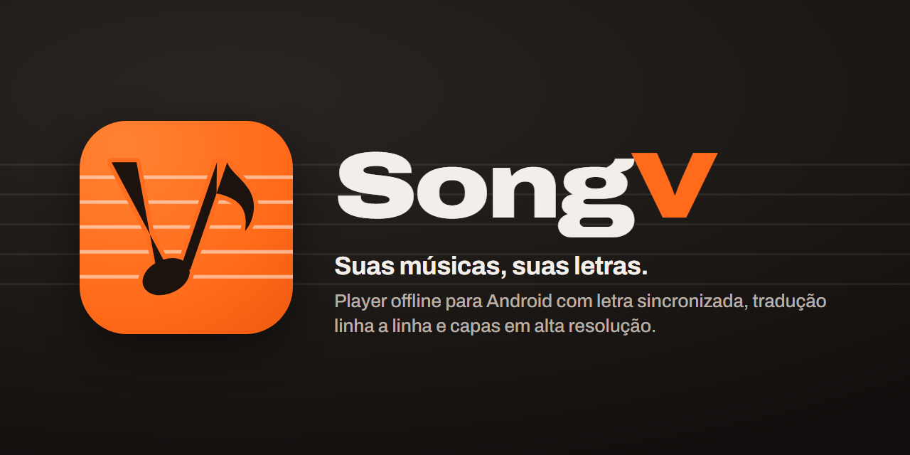
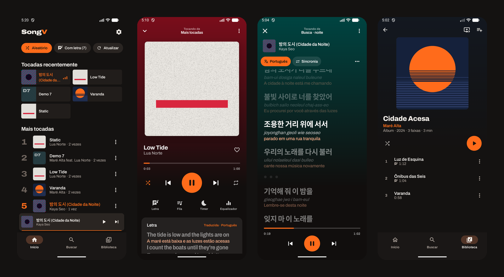

<p align="center">
  
</p>

<p align="center">
  <a href="https://github.com/victor-kauan-coder/SongV/releases/latest"></a>
  <a href="https://github.com/victor-kauan-coder/SongV/actions/workflows/android.yml"></a>
  
  
  <a href="LICENSE"></a>
</p>

<p align="center">
  <a href="https://github.com/victor-kauan-coder/SongV/releases/latest"><b>Baixar o APK</b></a> ·
  <a href="https://github.com/victor-kauan-coder/SongV/wiki"><b>Wiki</b></a> ·
  <a href="CHANGELOG.md"><b>Novidades</b></a> ·
  <a href="DESIGN.md"><b>Sistema visual</b></a>
</p>

---

**SongV** é um player de música para Android, 100% local, feito para quem se importa com a **letra**. Ele toca os MP3 do seu aparelho — incluindo os gerados pelo agente com capa e letra sincronizada embutidas — e mostra a letra como **legenda de cinema**: a linha certa no tempo certo, com a **tradução** e a **pronúncia** logo abaixo.

<p align="center">
  
</p>

## O que ele faz

### Letra como legenda
- **Letra sincronizada** a partir do frame `SYLT`, de arquivos `.lrc` ao lado da música ou de LRC gravado dentro do `USLT`.
- **Tradução linha a linha** em 16 idiomas, exibida abaixo do original (ou só a tradução), que continua ligada nas próximas faixas.
- **Romanização** para letras em coreano, japonês, chinês, russo… (`밤의 도시` → *bam-ui dosi*).
- **Buscar letra online** na [LRCLIB](https://lrclib.net) quando o arquivo não tem letra, ou **importar um `.lrc`** do aparelho.
- **Ajuste de sincronia** por faixa (±0,25 s), tamanho do texto, toque numa linha para pular até ela, indicador animado nas introduções e trechos instrumentais.

### Capas do álbum
- Capas em **alta resolução** no player, miniaturas rápidas nas listas e na notificação.
- A **capa frontal** é escolhida corretamente quando o arquivo tem várias imagens.
- **Fundo do player tingido pela capa**, sempre com contraste para o texto.
- Faixas sem capa ganham uma **capa gerada** com a cor do álbum, iniciais e sulcos de vinil.
- Playlists com **mosaico 2×2** das capas dos álbuns.

### Biblioteca e reprodução
- **Início** com tocadas recentemente, mais tocadas, álbuns, adicionadas recentemente e artistas.
- **Busca** que ignora acentos ("voce" encontra "Você") em faixas, álbuns, artistas e playlists.
- **Álbuns** e **artistas** montados pelas tags, com faixas numeradas e duração total.
- **Fila** que respeita o modo aleatório, com **arrastar para reordenar**, deslizar para remover, *tocar a seguir* e *adicionar à fila*.
- **Playlists** com seleção múltipla, reordenação e exclusão com *desfazer*; **Favoritas** fixada no topo.
- **Timer de sono** (minutos ou fim da faixa) com volume diminuindo aos poucos, **equalizador do sistema**, **retomar de onde parou**.
- Controles na **notificação**, tela de bloqueio e fones Bluetooth; pausa ao desconectar o fone.

### Identidade própria
- Visual **hi-fi analógico**: grafite quente + laranja-sinal, tipografia **Archivo**, modo escuro, claro ou do sistema e 7 cores de destaque (ou a sua).
- Ícone novo: o **V é uma colcheia** escrita num pentagrama.

## Instalação

1. Baixe o `SongV-*.apk` na [última versão](https://github.com/victor-kauan-coder/SongV/releases/latest).
2. Abra o arquivo no celular e permita a instalação de apps desta fonte.
3. Coloque suas músicas na pasta **Music** (ou escolha outra pasta nas configurações) e conceda o acesso quando o app pedir.

Requer **Android 8.0** ou mais recente. Detalhes na wiki: [Instalação](https://github.com/victor-kauan-coder/SongV/wiki/Instalação) e [Guia de uso](https://github.com/victor-kauan-coder/SongV/wiki/Guia-de-uso).

## Compilar

Com o **JDK 17+** e o **Android SDK** (API 34):

```bash
./gradlew assembleDebug          # APK de teste em app/build/outputs/apk/debug/
./gradlew testDebugUnitTest      # testes dos parsers ID3, LRC e da tradução
```

O build de release lê a assinatura de um `keystore.properties` na raiz (fora do git) — veja [Desenvolvimento](https://github.com/victor-kauan-coder/SongV/wiki/Desenvolvimento). Para testar sem músicas próprias, gere uma biblioteca de demonstração sintética com `python ferramentas/biblioteca_demo.py saida/`.

## Estrutura

```
app/src/main/java/com/songv/app/
├── id3/      parser ID3v2 próprio (v2.2–2.4, SYLT, USLT, APIC)
├── letra/    LRC, resolução da letra, LRCLIB e tradução
├── data/     varredura da biblioteca, capas (+ provider), preferências
├── model/    Musica, Album, Artista, Playlist, Letra
├── player/   ExoPlayer + MediaSession, serviço, ViewModel, timer de sono
└── ui/       tema, componentes e telas em Jetpack Compose
```

A arquitetura completa está em [Arquitetura](https://github.com/victor-kauan-coder/SongV/wiki/Arquitetura) e o formato das tags em [Formato das tags ID3](https://github.com/victor-kauan-coder/SongV/wiki/Formato-das-tags-ID3).

## Privacidade

O SongV não tem conta, anúncios nem telemetria. A internet só é usada quando você pede: para **buscar uma letra** (LRCLIB) ou **traduzir** (Google Tradutor). O resultado fica salvo no aparelho.

## Créditos

Feito por **Victor K** — [@victor-kauan-coder](https://github.com/victor-kauan-coder).

- Fonte [Archivo](https://github.com/Omnibus-Type/Archivo) — SIL Open Font License 1.1 ([licença](third_party/Archivo-OFL.txt))
- Letras sincronizadas: [LRCLIB](https://lrclib.net)
- Reprodução: [AndroidX Media3](https://developer.android.com/media/media3)

Distribuído sob a [licença MIT](LICENSE).
